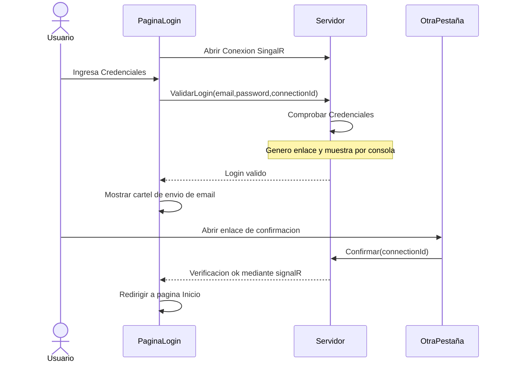

```mermaid
sequenceDiagram
    actor u as Usuario
    participant  p1 as PaginaLogin
    participant  p2 as Servidor
    participant  p3 as OtraPestaña
    
    p1->> p2: Abrir Conexion SingalR
    u ->> p1: Ingresa Credenciales
    p1->> p2: ValidarLogin(email,password,connectionId)
    p2->> p2: Comprobar Credenciales
    Note over p2: Genero enlace y muestra por consola
    p2-->> p1: Login valido
    p1->> p1: Mostrar cartel de envio de email
    u->> p3: Abrir enlace de confirmacion
    p3->> p2: Confirmar(connectionId)
    p2-->> p1: Verificacion ok mediante signalR
    p1->> p1: Redirigir a pagina Inicio
    
```